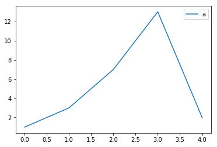

```python
import pandas as pd
%matplotlib inline

df = pd.DataFrame({'a': [1, 3, 7, 13, 2]})
df
```


<div>
<style scoped>
    .dataframe tbody tr th:only-of-type {
        vertical-align: middle;
    }

    .dataframe tbody tr th {
        vertical-align: top;
    }

    .dataframe thead th {
        text-align: right;
    }
</style>
<table border="1" class="dataframe">
  <thead>
    <tr style="text-align: right;">
      <th></th>
      <th>a</th>
    </tr>
  </thead>
  <tbody>
    <tr>
      <th>0</th>
      <td>1</td>
    </tr>
    <tr>
      <th>1</th>
      <td>3</td>
    </tr>
    <tr>
      <th>2</th>
      <td>7</td>
    </tr>
    <tr>
      <th>3</th>
      <td>13</td>
    </tr>
    <tr>
      <th>4</th>
      <td>2</td>
    </tr>
  </tbody>
</table>
</div>


```python
df.plot()
```


    <matplotlib.axes._subplots.AxesSubplot at 0x10ccc7f90>




